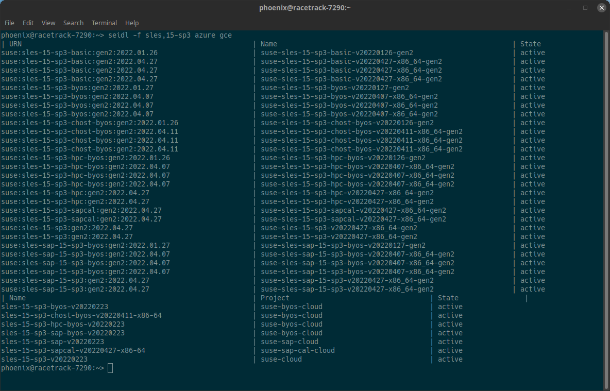

# seidl

`seidl` is a lightweight [pint](https://pint.suse.com/) client, designed for easy usage to query the current images of SUSE publiccloud images.

In aims at complementing the [public-cloud-info-client](https://github.com/SUSE-Enceladus/public-cloud-info-client) by the feature to display all current not-deleted and not-deprecated images in a nice table on the console.

Image information are fetched from `https://susepubliccloudinfo.suse.com/v1/[microsoft|amazon|google]/images.json` and then parsed accordingly.

`seidl` is named after a small beer quantity in Austria because it's slightly smaller than a pint (typically 0.3 liters).

## Build

The lazy way:

    make

    make seidl install                 # the very lazy way. Build and install to ~/bin

Canonical go way:

    go build ./...

Requirements: Pure `go` only, no external dependencies

## Usage

The basic usage is as follows:

    ./seidl -h                           # Print help
    
    ./seidl gce                          # Query current GCE images
    ./seidl --region eu-west-1 aws       # Query current AWS images
    ./seidl azure                        # Query current Azure images

You can also filter results using the `-f` arguments. It supports a comma separated list of strings, where every entry of that list must be present in the image name.

Some more advanced examples are:

    ./seidl -f sles,15-sp3 gce           # List GCE images, filter for SLES 15-SP3 images
    ./seidl -f sles,15-sp3 azure gce     # List Azure and GCE images, filter for SLES 15-SP3 images
    
    ./seidl --list-aws-regions           # List available AWS regions