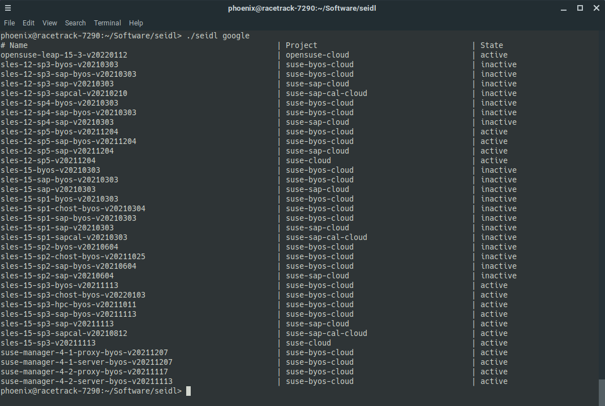

# seidl

`seidl` is a lightweight [pint](https://pint.suse.com/) client, designed for easy usage to query the current images of SUSE publiccloud images.

In aims at complementing the [public-cloud-info-client](https://github.com/SUSE-Enceladus/public-cloud-info-client) by the feature to display all current not-deleted and not-deprecated images in a nice table on the console.

Image information are fetched from `https://susepubliccloudinfo.suse.com/v1/[microsoft|amazon|google]/images.json` and then parsed accordingly.

`seidl` is named after a small beer quantity in Austria because it's slightly smaller than a pint (typically 0.3 liters).

## Usage

    ./seidl gce                          # Query current GCE images
    ./seidl aws --region eu-west-1       # Query current AWS images
    ./seidl azure                        # Query current Azure images

## Installation

    install seidl ~/bin

This is a standalone python script (`seidl`) with the following requirements:

* `requests`
* `json`